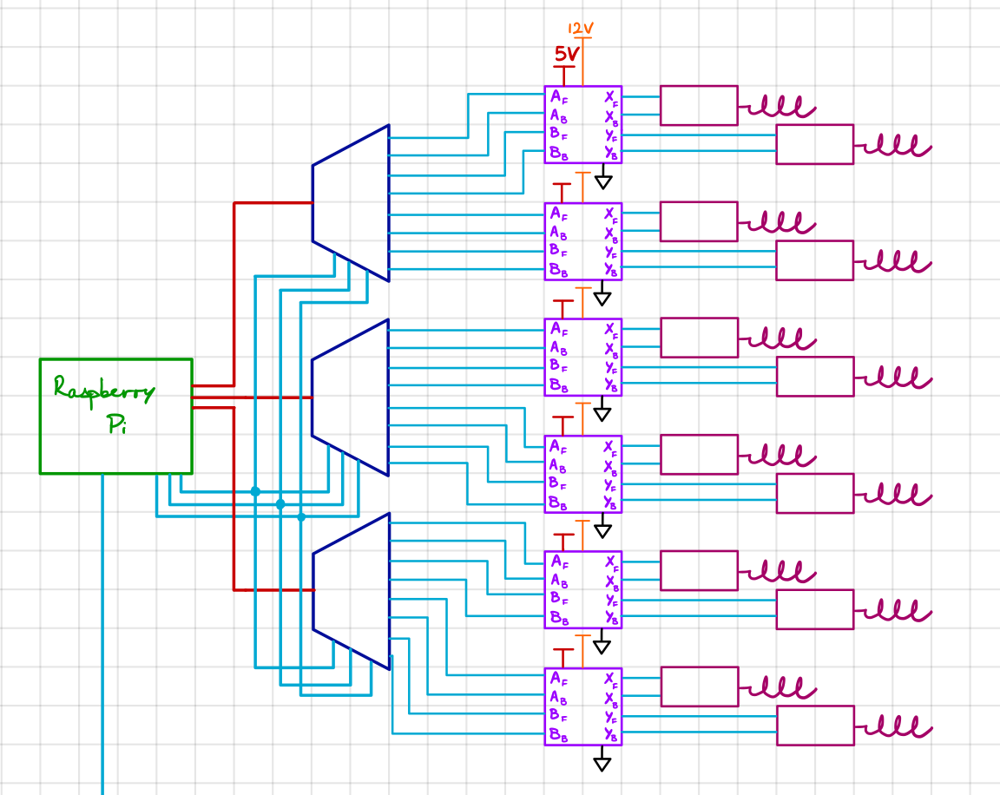

# Ramen Vending Machine

Completed Fall 2017
Team: Darien Joso, Christopher McElroy, John Lee, Herrick Fang, Teerapat Jenrungrot

### Pictures
 

### Problem

Can we create a Ramen Vending Machine that works when you Venmo a certain person to distribute ramen? 

### Solution Design

Yes. It came out beautifully and is being used pretty frequently~ 

Hardware:
- Raspberry Pi for Wifi + GPIO interface
- 12 motors (30rpm - 12V)
- 12 coils
- Power Source 12 2A + 5V
- 3 3-bit demultiplexers  
- 6 dual motor H-bridges

Wiring:

Software:
- Python scripting + C Memory Mapped I/O
- Parse Venmo using email to get the amount paid.
- Store past orders in a simple csv file.
- Control GPIO pins to turn on/off coils for X amount of time.

#### Usage

Let this run on your raspberry pi forever~ 

`python3 starter.py & `
