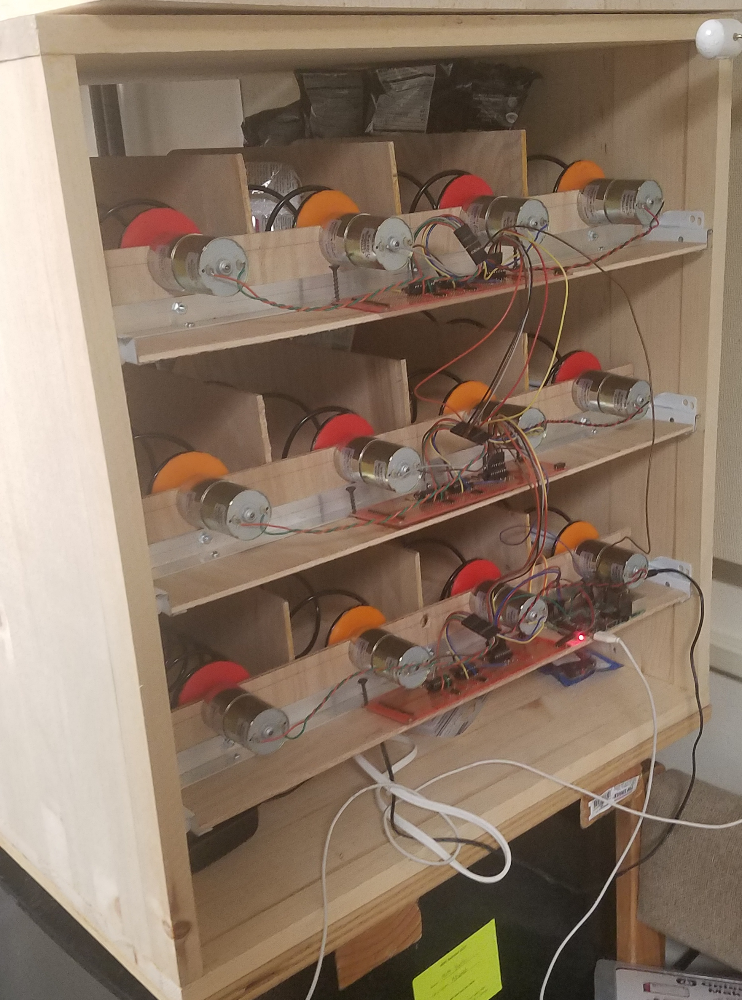

# Ramen Vending Machine

Completed Fall 2017
Team: Darien Joso, Christopher McElroy, John Lee, Herrick Fang, Teerapat Jenrungrot

### Problem

Can we create a Ramen Vending Machine that works when you Venmo a certain person to distribute ramen? 

### Solution Design

Yes. It came out beautifully and is being used pretty frequently in our college. 

Hardware:
- Raspberry Pi, Wifi + GPIO interface

Software:
- Parse Venmo using email to get the amount paid.
- Store past orders in a simple csv file.
- Control GPIO pins to turn on/off coils for X amount of time.

#### Usage

Let this run on your raspberry pi forever~ 

`python3 starter.py & `
